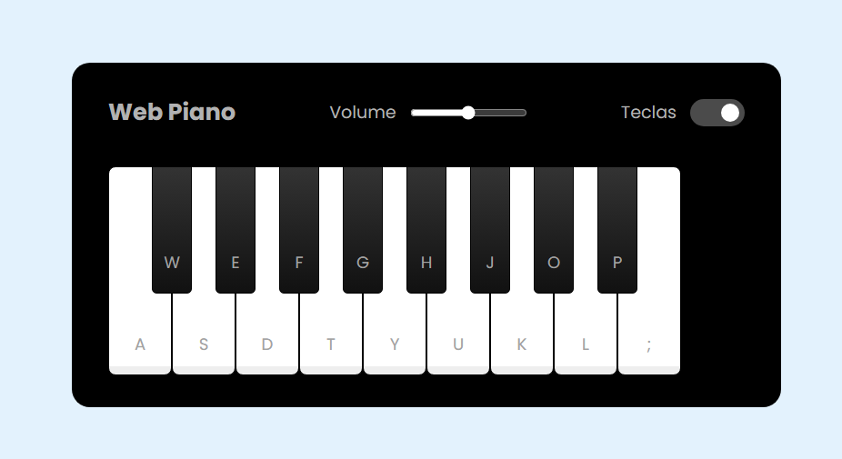

# Web Piano 🎹

Um piano interativo construído com **HTML**, **CSS** e **JavaScript**. Este projeto permite que usuários toquem melodias diretamente no navegador, ajustem o volume e exibam/ocultem as teclas.

## 🌟 Funcionalidades

- **Toque no teclado**: Use o mouse ou o teclado físico para tocar as notas.
- **Ajuste de volume**: Controle o volume do áudio com um slider.
- **Mostrar/Ocultar teclas**: Alternar a visibilidade dos rótulos das teclas no piano.

## 🖼 Prévia

## ✨ Personalização
Para adicionar novas notas, coloque os arquivos .wav na pasta tunes/ e configure os elementos no HTML com os atributos data-key correspondentes.
Edite os estilos no arquivo styles/main.css para alterar o visual.
## 🛠 Tecnologias Utilizadas
- HTML5: Estrutura do conteúdo.
- CSS3: Estilização e design responsivo.
- JavaScript: Lógica de interação e manipulação de eventos.

## 💻 Deploy

### <a href='https://nosferavic.github.io/piano/'>Web Piano</a>
